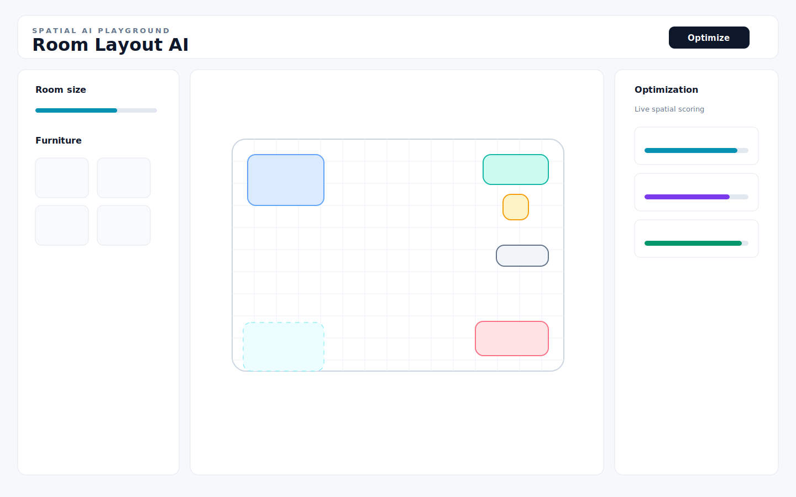

# Room Layout AI

[](https://github.com/rsasaki0109/room-layout-ai/actions/workflows/deploy.yml)


Room Layout AI is a **Spatial AI Playground** for instantly optimizing 2D room layouts in the browser. Add furniture, drag it around, rotate pieces, then hit **Optimize** to watch the room reorganize with smooth AI-like motion and live score changes.



## Demo URL

https://rsasaki0109.github.io/room-layout-ai/

## Release

Current release: `v0.1.0`

See [CHANGELOG.md](CHANGELOG.md) for release notes.

This repo is configured with Vite `base: "/room-layout-ai/"` and a GitHub Pages workflow, so a push to `main` can publish the app without a backend.

## Screenshot



## Concept

This is not a traditional interior tool. It is a small, fast, visual demo of what spatial AI interfaces could feel like: furniture behaves like optimization agents, the room has constraints, and scores react as the layout improves.

The MVP intentionally uses a lightweight heuristic optimizer instead of a backend AI service. The priority is demo quality: press **Optimize**, see furniture move, get a better layout.

## Features

- 2D room editor powered by React Konva
- Room width and depth controls
- Furniture palette: bed, desk, chair, sofa, monitor, shelf
- Drag-to-move furniture
- Rotate and remove selected furniture
- Messy Room preset for dramatic before/after optimization demos
- AI-style Optimize button with animated spatial scan
- Before/after movement trails for optimized furniture
- Heuristic layout optimization for wall alignment, door clearance, collisions, and open center paths
- Animated score cards:
  - Walking Efficiency
  - Workspace Score
  - Comfort Score
  - Free Space
  - Focus Score
- Score deltas after optimization
- AI suggestion panel for shareable demo context
- High-resolution PNG export for demos, README assets, and social posts
- Copyable layout summary for social posts or issue reports
- Fully frontend-only: no auth, no database, no backend
- GitHub Pages deployment workflow included

## Tech Stack

- React
- TypeScript
- Vite
- TailwindCSS
- Zustand
- Framer Motion
- React Konva / Konva
- GitHub Pages

## Local Development

```bash
npm install
npm run dev
```

Build:

```bash
npm run build
```

Preview production output:

```bash
npm run preview
```

## GitHub Pages Deploy

1. Push this repository to GitHub.
2. In repository settings, enable GitHub Pages with **GitHub Actions** as the source.
3. Push to `main`.
4. The workflow in `.github/workflows/deploy.yml` builds `dist/` and deploys it.

## Roadmap

- Photo upload
- Room scanning
- AR placement
- LLM layout suggestions
- 3D mode
- Interior style generation
- Robot vacuum simulation
- VLM room image parsing
- NeRF / Gaussian Splatting scenes
- ROS2 navigation exports
- Embodied AI experiments

## Design Philosophy

Small, fast, interesting, and instantly usable. The app favors a polished interaction loop over heavy architecture: canvas first, movement first, delight first.

## License

MIT
